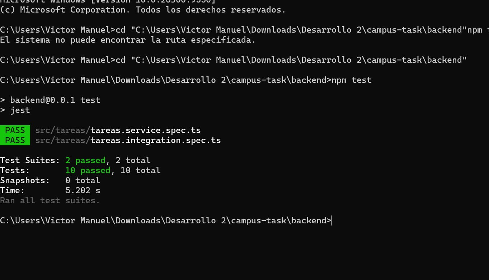
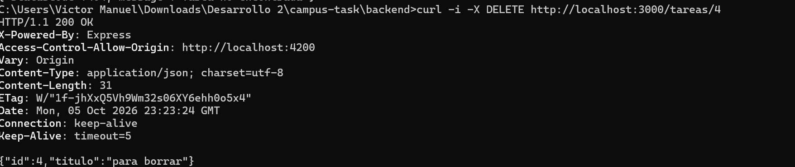
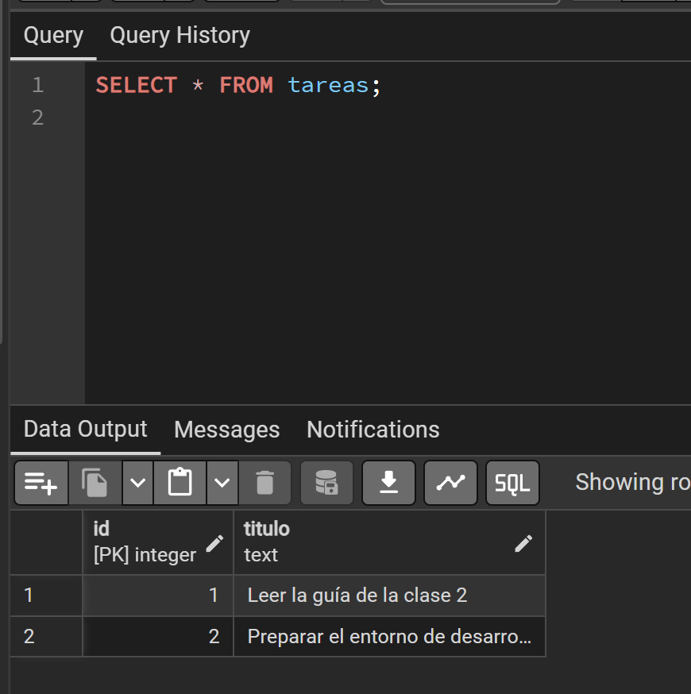
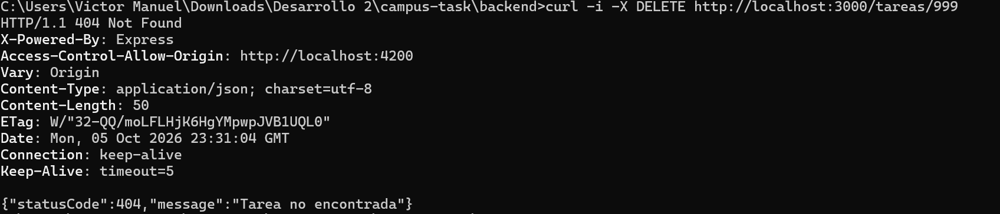
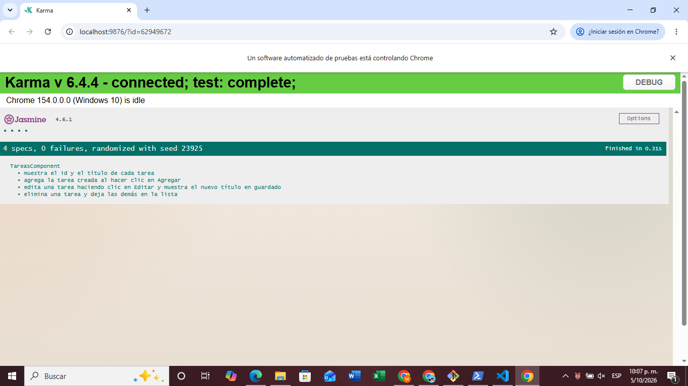
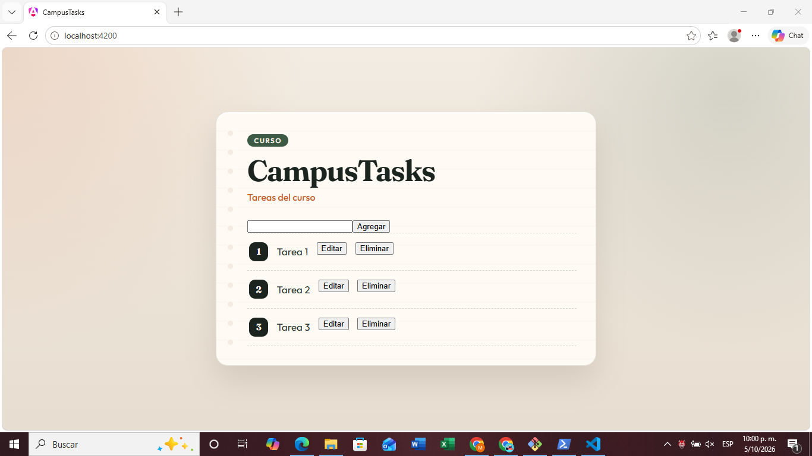
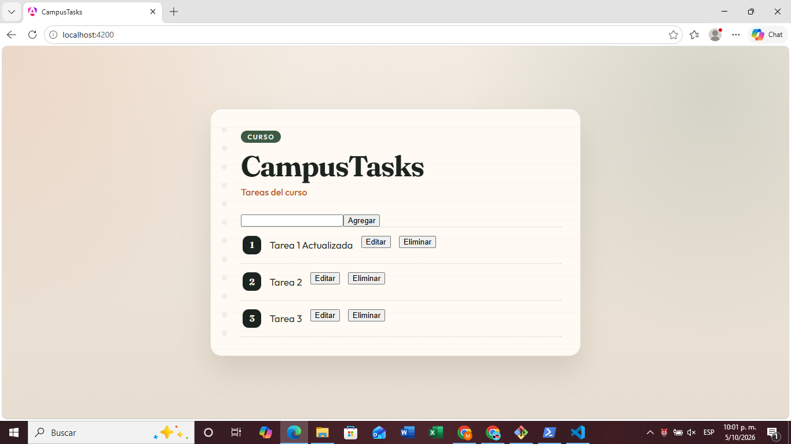
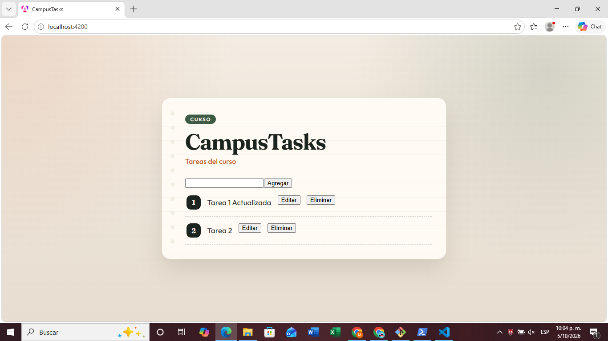
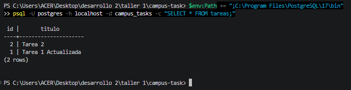

# ENTREGA - CampusTasks

## Datos
- **Personas:** Juan Sebastian Perez 2459371 Mariana Rios 2459759 Victor Murillo 2459569
- **Fecha:** 3 de octubre de 2026
- **Rama:** taller/actualizar-eliminar-tareas

---

## Trabajo

### PostgreSQL
- Instalado: PostgreSQL 18.6
- BD creada: `campus_tasks`
- Tabla: `tareas (id SERIAL PRIMARY KEY, titulo TEXT NOT NULL)`

### Variables de entorno (.env)
```env
DB_HOST=127.0.0.1
DB_PORT=5432
DB_USER=postgres
DB_PASSWORD=(contraseña local)
DB_NAME=campus_tasks
```

### Backend y Frontend verificados
 - Backend en http://localhost:3000  
 - Frontend en http://localhost:4200  
 - Pruebas iniciales pasando

---

## Lectura de ejemplos

El repositorio traía pruebas en:
- `tareas.service.spec.ts` - Pruebas unitarias
- `tareas.integration.spec.ts` - Pruebas de integración
- `tareas.component.spec.ts` - Pruebas de componente

**Patrón entendido:**
1. **Preparar:** Mock de la BD con query simulado
2. **Ejecutar:** Llamar al método/ruta
3. **Verificar:** Que el resultado es correcto y query se llamó con parámetros esperados

Las pruebas nuevas siguen exactamente ese patrón.

---

## Implementación: Actualizar

### Servicio (backend/src/tareas/tareas.service.ts)

Se agrega el método `actualizar()`:

```typescript
async actualizar(id: number, titulo: string): Promise<Tarea> {
  const result = await this.db.query(
    'UPDATE tareas SET titulo = $1 WHERE id = $2 RETURNING id, titulo',
    [titulo, id],
  );
  return result.rows[0] as Tarea;
}
```

### Controlador (backend/src/tareas/tareas.controller.ts)

Se agrega ruta PATCH:

```typescript
@Patch(':id')
async actualizar(
  @Param('id') id: string,
  @Body('titulo') titulo: string,
): Promise<Tarea> {
  const tarea = await this.tareasService.actualizar(Number(id), titulo);
  if (!tarea) {
    throw new HttpException('Tarea no encontrada', 404);
  }
  return tarea;
}
```

**Decisiones:**
- Conversión de id: `Number(id)` convierte string a number
- Detección de 404: `if (!tarea)` verifica si rows está vacío

### Pruebas - Backend

#### Unitarias (tareas.service.spec.ts)
- Actualiza el título y devuelve la fila actualizada

Verifica:
- `query` se llama con UPDATE y parámetros [titulo, id]
- Devuelve la tarea actualizada

#### Integración (tareas.integration.spec.ts)
- PATCH /tareas/:id devuelve 200 con la tarea actualizada
- PATCH /tareas/:id devuelve 404 si la tarea no existe

Verifica:
- Caso 200: PATCH a id existente responde 200 con tarea
- Caso 404: PATCH a id inexistente responde 404

### Prueba manual
- PATCH http://localhost:3000/tareas/1 → 200 OK
- BD cambió correctamente
- PATCH a id 999 → 404 Not Found

---

## Pruebas - Resultado
### npm test Backend

- Test Suites: 2 passed, 2 total
- Tests: 7 passed, 7 total
- Todas las pruebas pasan: 3 unitarias (listar, crear, actualizar) + 4 integración.

---
## Pruebas Manuales E2E 

### PATCH Exitoso - Actualizar tarea


Comando:
```bash
$body = @{ titulo = "TAREA 1 ACTUALIZADA" } | ConvertTo-Json
Invoke-WebRequest -Uri "http://localhost:3000/tareas/1" -Method PATCH -Headers @{"Content-Type"="application/json"} -Body $body
```

Respuesta: `StatusCode: 200` con `{"id":1,"titulo":"TAREA 1 ACTUALIZADA"}`

### BD Verificada


Comando:
```bash
psql -U postgres -d campus_tasks -c "SELECT * FROM tareas;"
```

Resultado: La tarea 1 muestra el título "TAREA 1 ACTUALIZADA"

### PATCH 404 - Tarea no existe


Comando:
```bash
$body = @{ titulo = "No existe" } | ConvertTo-Json
Invoke-WebRequest -Uri "http://localhost:3000/tareas/999" -Method PATCH -Headers @{"Content-Type"="application/json"} -Body $body
```

Respuesta: Error con `statusCode:404` y mensaje "Tarea no encontrada"

---

## Git

### Rama creada
```bash
git checkout -b taller/actualizar-eliminar-tareas-2459371
```

### Cambios agregados al staging
```bash
git add backend/src/tareas/tareas.service.ts
git add backend/src/tareas/tareas.controller.ts
git add backend/src/tareas/tareas.service.spec.ts
git add backend/src/tareas/tareas.integration.spec.ts
git add ENTREGA.md
git add screenshots/
```

### Commit realizado
```bash
git commit -m "[Jperez] Implementación completa: Actualizar tareas con pruebas y documentación"
```

### Push a remoto
```bash
git push -u origin taller/actualizar-eliminar-tareas-2459371
```

---

## Implementación: Eliminar

### Servicio (backend/src/tareas/tareas.service.ts)

Se agrega el método `eliminar()`:

```typescript
async eliminar(id: number): Promise<Tarea> {
  const result = await this.db.query(
    'DELETE FROM tareas WHERE id = $1 RETURNING id, titulo',
    [id],
  );
  return result.rows[0] as Tarea;
}
```

SQL: `DELETE FROM tareas WHERE id = $1 RETURNING id, titulo` (consulta parametrizada).

### Controlador (backend/src/tareas/tareas.controller.ts)

Se agrega ruta DELETE:

```typescript
@Delete(':id')
async eliminar(@Param('id') id: string): Promise<Tarea> {
  const tarea = await this.tareasService.eliminar(Number(id));
  if (!tarea) {
    throw new HttpException('Tarea no encontrada', 404);
  }
  return tarea;
}
```

**Decisiones:**
- Conversión de id: `Number(id)` convierte string a number, igual que en PATCH
- Detección de 404: si la consulta no devuelve filas, `rows[0]` es `undefined` y `if (!tarea)` lanza 404

### Pruebas - Backend

#### Unitarias (tareas.service.spec.ts)
- Elimina la tarea por id y devuelve la fila eliminada

Verifica:
- `query` se llama con DELETE y parámetro [id]
- Devuelve la tarea eliminada

#### Integración (tareas.integration.spec.ts)
- DELETE /tareas/:id devuelve 200 con la tarea eliminada
- DELETE /tareas/:id devuelve 404 si la tarea no existe

Verifica:
- Caso 200: DELETE a id existente responde 200 con tarea
- Caso 404: DELETE a id inexistente responde 404

### Prueba manual
- DELETE http://localhost:3000/tareas/4 → 200 OK
- BD cambió correctamente
- DELETE a id 999 → 404 Not Found

---

## Pruebas - Resultado (Eliminar)
### npm test Backend

- Test Suites: 2 passed, 2 total
- Tests: 10 passed, 10 total
- Todas las pruebas pasan: 4 unitarias (listar, crear, actualizar, eliminar) + 6 integración.

---
## Pruebas Manuales E2E (Eliminar)

### DELETE Exitoso - Eliminar tarea



Comando:
```bash
curl -i -X DELETE http://localhost:3000/tareas/4
```

Respuesta: `HTTP/1.1 200 OK` con `{"id":4,"titulo":"para borrar"}`

### BD Verificada



Comando (pgAdmin, Query Tool):
```sql
SELECT * FROM tareas;
```

Resultado: la tarea "para borrar" ya no aparece en la tabla

### DELETE 404 - Tarea no existe



Comando:
```bash
curl -i -X DELETE http://localhost:3000/tareas/999
```

Respuesta: `HTTP/1.1 404 Not Found` con `{"statusCode":404,"message":"Tarea no encontrada"}`

---

## Git (Eliminar)

### Rama creada
```bash
git checkout -b taller/eliminar-202459569
```

### Cambios agregados al staging
```bash
git add backend/src/tareas/tareas.service.ts
git add backend/src/tareas/tareas.controller.ts
git add backend/src/tareas/tareas.service.spec.ts
git add backend/src/tareas/tareas.integration.spec.ts
git add ENTREGA.md
git add screenshots/
```

### Commit realizado
```bash
git commit -m "Agrega eliminar tarea: servicio, ruta DELETE /tareas/:id y pruebas unitarias e integración"
```

### Push a remoto
```bash
git push -u origin taller/eliminar- 202459569
```
**Nota:** El archivo `.env` no se incluyó en los commits (está en `.gitignore`)


----

## Implementacion Frontend 

Se agregan dos metodos ya creados anteriormente:

### Servicio (frontend/src/components/tareas/tareas.service.ts)


```typescript
actualizar(id: number, titulo: string): Observable<Tarea> {
  return this.http.patch<Tarea>(`${this.apiUrl}/tareas/${id}`, { titulo });
}
eliminar(id: number): Observable<Tarea> {
  return this.http.delete<Tarea>(`${this.apiUrl}/tareas/${id}`);
}
```
---

### Componente (frontend/src/components/tareas/tareas.component.ts)

```typescript
editandoId = signal<number | null>(null);
  editar(id: number) {
    this.editandoId.set(id);
  }
  actualizar(id: number, titulo: string) {
    this.tareasService.actualizar(id, titulo).subscribe((tarea) => {
      this.tareas.update((tareas) => tareas.map((t) => (t.id === id ? tarea : t)));
      this.editandoId.set(null);
    });
  }
  eliminar(id: number) {
    this.tareasService.eliminar(id).subscribe(() => {
      this.tareas.update((tareas) => tareas.filter((t) => t.id !== id));
    });
  }
```
---

### Html (frontend/src/components/tareas/tareas.component.html)

```html
@if (editandoId() === tarea.id) {
  <input type="text" class="edicion" #edicionInput [value]="tarea.titulo" />
  <button class="guardar" (click)="actualizar(tarea.id, edicionInput.value)">Guardar</button>
} @else {
  <span class="titulo">{{ tarea.titulo }}</span>
  <button class="editar" (click)="editar(tarea.id)">Editar</button>
}
<button class="eliminar" (click)="eliminar(tarea.id)">Eliminar</button>
```
---

**NOTAS**
- `editandoId` guarda solo el id de la tarea que se está editando (o `null`). Con eso cada tarea decide si muestra el texto o un campo para escribir.
- La lista local cambia solo después de que el backend responde, para que la pantalla nunca muestre algo que la base de datos no tiene.
- `map` reemplaza solo la tarea editada y `filter` quita solo la eliminada.
- `@if` y `@else` es la sintaxis actual de Angular, la misma familia que el `@for` que ya traía desde el repositorio original y/o plantilla.

---

### Pruebas - Frontend (tareas.component.spec.ts)

Siguen el patrón de las pruebas del repositorio (preparar, ejecutar, verificar). El servicio se reemplaza por un spy de Jasmine, que es un servicio falso: así las pruebas no dependen del backend.

- **Editar:** (preparar) el spy de `actualizar` devuelve la tarea con el título nuevo. (ejecutar) clic en Editar, se escribe en el campo y clic en Guardar. (verificar) `actualizar` se llamó con `(1, 'Guía editada')` y la pantalla muestra el título nuevo.
- **Eliminar:** (preparar) la lista tiene 2 tareas y el spy de `eliminar` devuelve la tarea borrada. (ejecutar) clic en Eliminar. (verificar) `eliminar` se llamó con `1` y en pantalla solo queda la otra tarea.

### **npm test Frontend**

- Specs: 4, failures: 0 (2 del repositorio y 2 nuevas).

---

## Pruebas Manuales E2E (Frontend en http://localhost:4200)

Con el backend en `http://localhost:3000` y el frontend en `http://localhost:4200`.

### Lista inicial


### Editar una tarea
Clic en **Editar** en la Tarea 1, se cambia el texto y clic en **Guardar**.


Después de refrescar la página (F5), el título nuevo sigue ahí:



### Eliminar una tarea
Clic en **Eliminar** en la Tarea 3. Después de refrescar, las otras dos siguen:



### Base de datos verificada
Comando:
```bash
psql -U postgres -h localhost -d campus_tasks -c "SELECT * FROM tareas;"
```


---

## Git (Frontend)

```bash
git checkout -b taller/frontend-202459759
git add ENTREGA.md
git add frontend/src/components/tareas
git add screenshots/frontend-bd.png
git add screenshots/frontend-editando.png
git add screenshots/frontend-editar-guardado.png
git add screenshots/frontend-eliminar.png
git add screenshots/frontend-lista-inicial.png
git add screenshots/frontend-npm-test.png
git commit -m "feat: Se Agrega el Frontend de editar y eliminar con pruebas y documentacion"
git push -u origin taller/frontend-202459759
```
El archivo `.env` no se incluyó en los commits (está en `.gitignore`).

## Integración final

La rama del frontend se creó después de unir las ramas del backend, así que contiene la integración final en `master`:

**Nota:** Intergrado con pull request en github

```bash
git checkout master
git pull
git merge taller/frontend-202459759
git push
```

### Resultados finales
| Carpeta | Comando | Resultado |
|---|---|---|
| backend | `npm test` | 10 pruebas pasando |
| frontend | `npm test` | 4 specs, 0 failures |