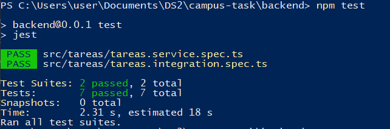
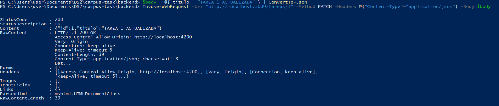
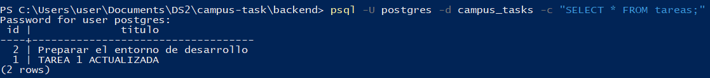
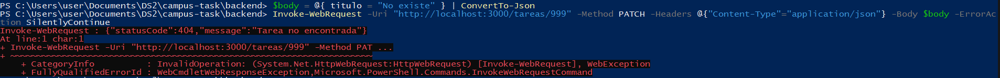

# ENTREGA - CampusTasks

## Datos
- **Personas:** Juan Sebastian Perez 2459371 Mariana Rios 2459759 Victor Murillo 2459569
- **Fecha:** 3 de octubre de 2026
- **Rama:** taller/actualizar-eliminar-tareas

---

## Trabajo

### PostgreSQL
- Instalado: PostgreSQL 18.6
- BD creada: `campus_tasks`
- Tabla: `tareas (id SERIAL PRIMARY KEY, titulo TEXT NOT NULL)`

### Variables de entorno (.env)
```env
DB_HOST=127.0.0.1
DB_PORT=5432
DB_USER=postgres
DB_PASSWORD=(contraseña local)
DB_NAME=campus_tasks
```

### Backend y Frontend verificados
 - Backend en http://localhost:3000  
 - Frontend en http://localhost:4200  
 - Pruebas iniciales pasando

---

## Lectura de ejemplos

El repositorio traía pruebas en:
- `tareas.service.spec.ts` - Pruebas unitarias
- `tareas.integration.spec.ts` - Pruebas de integración
- `tareas.component.spec.ts` - Pruebas de componente

**Patrón entendido:**
1. **Preparar:** Mock de la BD con query simulado
2. **Ejecutar:** Llamar al método/ruta
3. **Verificar:** Que el resultado es correcto y query se llamó con parámetros esperados

Las pruebas nuevas siguen exactamente ese patrón.

---

## Implementación: Actualizar

### Servicio (backend/src/tareas/tareas.service.ts)

Se agrega el método `actualizar()`:

```typescript
async actualizar(id: number, titulo: string): Promise<Tarea> {
  const result = await this.db.query(
    'UPDATE tareas SET titulo = $1 WHERE id = $2 RETURNING id, titulo',
    [titulo, id],
  );
  return result.rows[0] as Tarea;
}
```

### Controlador (backend/src/tareas/tareas.controller.ts)

Se agrega ruta PATCH:

```typescript
@Patch(':id')
async actualizar(
  @Param('id') id: string,
  @Body('titulo') titulo: string,
): Promise<Tarea> {
  const tarea = await this.tareasService.actualizar(Number(id), titulo);
  if (!tarea) {
    throw new HttpException('Tarea no encontrada', 404);
  }
  return tarea;
}
```

**Decisiones:**
- Conversión de id: `Number(id)` convierte string a number
- Detección de 404: `if (!tarea)` verifica si rows está vacío

### Pruebas - Backend

#### Unitarias (tareas.service.spec.ts)
- Actualiza el título y devuelve la fila actualizada

Verifica:
- `query` se llama con UPDATE y parámetros [titulo, id]
- Devuelve la tarea actualizada

#### Integración (tareas.integration.spec.ts)
- PATCH /tareas/:id devuelve 200 con la tarea actualizada
- PATCH /tareas/:id devuelve 404 si la tarea no existe

Verifica:
- Caso 200: PATCH a id existente responde 200 con tarea
- Caso 404: PATCH a id inexistente responde 404

### Prueba manual
- PATCH http://localhost:3000/tareas/1 → 200 OK
- BD cambió correctamente
- PATCH a id 999 → 404 Not Found

---

## Pruebas - Resultado
### npm test Backend

- Test Suites: 2 passed, 2 total
- Tests: 7 passed, 7 total
- Todas las pruebas pasan: 3 unitarias (listar, crear, actualizar) + 4 integración.

---
## Pruebas Manuales E2E 

### PATCH Exitoso - Actualizar tarea



Comando:
```bash
$body = @{ titulo = "TAREA 1 ACTUALIZADA" } | ConvertTo-Json
Invoke-WebRequest -Uri "http://localhost:3000/tareas/1" -Method PATCH -Headers @{"Content-Type"="application/json"} -Body $body
```

Respuesta: `StatusCode: 200` con `{"id":1,"titulo":"TAREA 1 ACTUALIZADA"}`

### BD Verificada



Comando:
```bash
psql -U postgres -d campus_tasks -c "SELECT * FROM tareas;"
```

Resultado: La tarea 1 muestra el título "TAREA 1 ACTUALIZADA"

### PATCH 404 - Tarea no existe



Comando:
```bash
$body = @{ titulo = "No existe" } | ConvertTo-Json
Invoke-WebRequest -Uri "http://localhost:3000/tareas/999" -Method PATCH -Headers @{"Content-Type"="application/json"} -Body $body
```

Respuesta: Error con `statusCode:404` y mensaje "Tarea no encontrada"

---

## Git

### Rama creada
```bash
git checkout -b taller/actualizar-eliminar-tareas-2459371
```

### Cambios agregados al staging
```bash
git add backend/src/tareas/tareas.service.ts
git add backend/src/tareas/tareas.controller.ts
git add backend/src/tareas/tareas.service.spec.ts
git add backend/src/tareas/tareas.integration.spec.ts
git add ENTREGA.md
git add screenshots/
```

### Commit realizado
```bash
git commit -m "[Jperez] Implementación completa: Actualizar tareas con pruebas y documentación"
```

### Push a remoto
```bash
git push -u origin taller/actualizar-eliminar-tareas-2459371
```

**Nota:** El archivo `.env` no se incluyó en los commits (está en `.gitignore`)